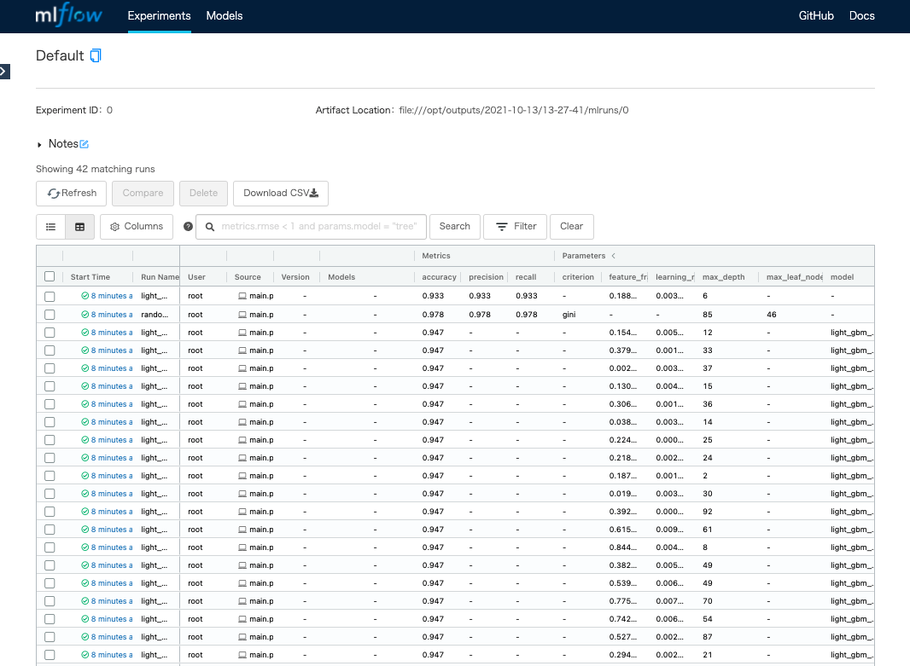

# mlflow_hydra_optuna_the_easy_way
combination of mlflow, hydra and optuna in the easy way

## Objective
TODO

## Usage

### 1. build docker image to run training jobs

```sh
$ make build
docker build \
    -t mlflow_hydra_optuna:the_easy_way \
    -f Dockerfile \
    .
[+] Building 1.8s (10/10) FINISHED
 => [internal] load build definition from Dockerfile                                                                       0.0s
 => => transferring dockerfile: 37B                                                                                        0.0s
 => [internal] load .dockerignore                                                                                          0.0s
 => => transferring context: 2B                                                                                            0.0s
 => [internal] load metadata for docker.io/library/python:3.9.5-slim                                                       1.7s
 => [1/5] FROM docker.io/library/python:3.9.5-slim@sha256:9828573e6a0b02b6d0ff0bae0716b027aa21cf8e59ac18a76724d216bab7ef0  0.0s
 => [internal] load build context                                                                                          0.0s
 => => transferring context: 17.23kB                                                                                       0.0s
 => CACHED [2/5] WORKDIR /opt                                                                                              0.0s
 => CACHED [3/5] COPY .//requirements.txt /opt/                                                                            0.0s
 => CACHED [4/5] RUN apt-get -y update &&     apt-get -y install     apt-utils     gcc &&     apt-get clean &&     rm -rf  0.0s
 => [5/5] COPY .//src/ /opt/src/                                                                                           0.0s
 => exporting to image                                                                                                     0.0s
 => => exporting layers                                                                                                    0.0s
 => => writing image sha256:256aa71f14b29d5e93f717724534abf0f173522a7f9260b5d0f2051c4607782e                               0.0s
 => => naming to docker.io/library/mlflow_hydra_optuna:the_easy_way                                                        0.0s

Use 'docker scan' to run Snyk tests against images to find vulnerabilities and learn how to fix them
```

### 2. run parameter search and training job

the parameters for optuna and hyper parameter search are in `hydra/default.yaml`

```sh
$ cat hydra/default.yaml
optuna:
  cv: 5
  n_trials: 20
  n_jobs: 1
random_forest_classifier:
  parameters:
    - name: criterion
      suggest_type: categorical
      value_range:
        - gini
        - entropy
    - name: max_depth
      suggest_type: int
      value_range:
        - 2
        - 100
    - name: max_leaf_nodes
      suggest_type: int
      value_range:
        - 2
        - 100
lightgbm_classifier:
  parameters:
    - name: num_leaves
      suggest_type: int
      value_range:
        - 2
        - 100
    - name: max_depth
      suggest_type: int
      value_range:
        - 2
        - 100
    - name: learning_rage
      suggest_type: uniform
      value_range:
        - 0.0001
        - 0.01
    - name: feature_fraction
      suggest_type: uniform
      value_range:
        - 0.001
        - 0.9


$ make run
docker run \
    -it \
    --name the_easy_way \
    -v /Users/shibuiyuusuke/mlflow_hydra_optuna_the_easy_way/hydra:/opt/hydra \
    -v /Users/shibuiyuusuke/mlflow_hydra_optuna_the_easy_way/outputs:/opt/outputs \
    mlflow_hydra_optuna:the_easy_way \
    python -m src.main
[2021-10-13 13:27:41,711] [1] [__main__] [INFO] [main.py:59] [main] config: {'optuna': {'cv': 5, 'n_trials': 20, 'n_jobs': 1}, 'random_forest_classifier': {'parameters': [{'name': 'criterion', 'suggest_type': 'categorical', 'value_range': ['gini', 'entropy']}, {'name': 'max_depth', 'suggest_type': 'int', 'value_range': [2, 100]}, {'name': 'max_leaf_nodes', 'suggest_type': 'int', 'value_range': [2, 100]}]}, 'lightgbm_classifier': {'parameters': [{'name': 'num_leaves', 'suggest_type': 'int', 'value_range': [2, 100]}, {'name': 'max_depth', 'suggest_type': 'int', 'value_range': [2, 100]}, {'name': 'learning_rage', 'suggest_type': 'uniform', 'value_range': [0.0001, 0.01]}, {'name': 'feature_fraction', 'suggest_type': 'uniform', 'value_range': [0.001, 0.9]}]}}
[2021-10-13 13:27:41,711][__main__][INFO] - config: {'optuna': {'cv': 5, 'n_trials': 20, 'n_jobs': 1}, 'random_forest_classifier': {'parameters': [{'name': 'criterion', 'suggest_type': 'categorical', 'value_range': ['gini', 'entropy']}, {'name': 'max_depth', 'suggest_type': 'int', 'value_range': [2, 100]}, {'name': 'max_leaf_nodes', 'suggest_type': 'int', 'value_range': [2, 100]}]}, 'lightgbm_classifier': {'parameters': [{'name': 'num_leaves', 'suggest_type': 'int', 'value_range': [2, 100]}, {'name': 'max_depth', 'suggest_type': 'int', 'value_range': [2, 100]}, {'name': 'learning_rage', 'suggest_type': 'uniform', 'value_range': [0.0001, 0.01]}, {'name': 'feature_fraction', 'suggest_type': 'uniform', 'value_range': [0.001, 0.9]}]}}
[2021-10-13 13:27:41,712] [1] [__main__] [INFO] [main.py:61] [main] cwd: /opt
[2021-10-13 13:27:41,712][__main__][INFO] - cwd: /opt
[2021-10-13 13:27:41,713] [1] [src.model.model] [INFO] [model.py:35] [__init__] initialize preprocess pipeline: Pipeline(steps=[('standard_scaler', StandardScaler())])
[2021-10-13 13:27:41,713][src.model.model][INFO] - initialize preprocess pipeline: Pipeline(steps=[('standard_scaler', StandardScaler())])
[2021-10-13 13:27:41,715] [1] [src.model.model] [INFO] [model.py:103] [__init__] initialize random forest classifier pipeline: Pipeline(steps=[('standard_scaler', StandardScaler()),
                ('model', RandomForestClassifier())])
[2021-10-13 13:27:41,715][src.model.model][INFO] - initialize random forest classifier pipeline: Pipeline(steps=[('standard_scaler', StandardScaler()),
                ('model', RandomForestClassifier())])
[2021-10-13 13:27:41,717] [1] [__main__] [INFO] [main.py:50] [parse_params] params: [SearchParams(name='criterion', suggest_type=<SUGGEST_TYPE.CATEGORICAL: 'categorical'>, value_range=['gini', 'entropy']), SearchParams(name='max_depth', suggest_type=<SUGGEST_TYPE.INT: 'int'>, value_range=(2, 100)), SearchParams(name='max_leaf_nodes', suggest_type=<SUGGEST_TYPE.INT: 'int'>, value_range=(2, 100))]
[2021-10-13 13:27:41,717][__main__][INFO] - params: [SearchParams(name='criterion', suggest_type=<SUGGEST_TYPE.CATEGORICAL: 'categorical'>, value_range=['gini', 'entropy']), SearchParams(name='max_depth', suggest_type=<SUGGEST_TYPE.INT: 'int'>, value_range=(2, 100)), SearchParams(name='max_leaf_nodes', suggest_type=<SUGGEST_TYPE.INT: 'int'>, value_range=(2, 100))]
[2021-10-13 13:27:41,717] [1] [src.model.model] [INFO] [model.py:138] [define_search_params] new search param: [SearchParams(name='criterion', suggest_type=<SUGGEST_TYPE.CATEGORICAL: 'categorical'>, value_range=['gini', 'entropy']), SearchParams(name='max_depth', suggest_type=<SUGGEST_TYPE.INT: 'int'>, value_range=(2, 100)), SearchParams(name='max_leaf_nodes', suggest_type=<SUGGEST_TYPE.INT: 'int'>, value_range=(2, 100))]
[2021-10-13 13:27:41,717][src.model.model][INFO] - new search param: [SearchParams(name='criterion', suggest_type=<SUGGEST_TYPE.CATEGORICAL: 'categorical'>, value_range=['gini', 'entropy']), SearchParams(name='max_depth', suggest_type=<SUGGEST_TYPE.INT: 'int'>, value_range=(2, 100)), SearchParams(name='max_leaf_nodes', suggest_type=<SUGGEST_TYPE.INT: 'int'>, value_range=(2, 100))]
[2021-10-13 13:27:41,720] [1] [src.model.model] [INFO] [model.py:162] [__init__] initialize lightgbm classifier pipeline: Pipeline(steps=[('standard_scaler', StandardScaler()),
                ('model', LGBMClassifier())])
[2021-10-13 13:27:41,720][src.model.model][INFO] - initialize lightgbm classifier pipeline: Pipeline(steps=[('standard_scaler', StandardScaler()),
                ('model', LGBMClassifier())])
[2021-10-13 13:27:41,722] [1] [__main__] [INFO] [main.py:50] [parse_params] params: [SearchParams(name='num_leaves', suggest_type=<SUGGEST_TYPE.INT: 'int'>, value_range=(2, 100)), SearchParams(name='max_depth', suggest_type=<SUGGEST_TYPE.INT: 'int'>, value_range=(2, 100)), SearchParams(name='learning_rage', suggest_type=<SUGGEST_TYPE.UNIFORM: 'uniform'>, value_range=(0.0001, 0.01)), SearchParams(name='feature_fraction', suggest_type=<SUGGEST_TYPE.UNIFORM: 'uniform'>, value_range=(0.001, 0.9))]
[2021-10-13 13:27:41,722][__main__][INFO] - params: [SearchParams(name='num_leaves', suggest_type=<SUGGEST_TYPE.INT: 'int'>, value_range=(2, 100)), SearchParams(name='max_depth', suggest_type=<SUGGEST_TYPE.INT: 'int'>, value_range=(2, 100)), SearchParams(name='learning_rage', suggest_type=<SUGGEST_TYPE.UNIFORM: 'uniform'>, value_range=(0.0001, 0.01)), SearchParams(name='feature_fraction', suggest_type=<SUGGEST_TYPE.UNIFORM: 'uniform'>, value_range=(0.001, 0.9))]
[2021-10-13 13:27:41,723] [1] [src.model.model] [INFO] [model.py:202] [define_search_params] new search param: [SearchParams(name='num_leaves', suggest_type=<SUGGEST_TYPE.INT: 'int'>, value_range=(2, 100)), SearchParams(name='max_depth', suggest_type=<SUGGEST_TYPE.INT: 'int'>, value_range=(2, 100)), SearchParams(name='learning_rage', suggest_type=<SUGGEST_TYPE.UNIFORM: 'uniform'>, value_range=(0.0001, 0.01)), SearchParams(name='feature_fraction', suggest_type=<SUGGEST_TYPE.UNIFORM: 'uniform'>, value_range=(0.001, 0.9))]
[2021-10-13 13:27:41,723][src.model.model][INFO] - new search param: [SearchParams(name='num_leaves', suggest_type=<SUGGEST_TYPE.INT: 'int'>, value_range=(2, 100)), SearchParams(name='max_depth', suggest_type=<SUGGEST_TYPE.INT: 'int'>, value_range=(2, 100)), SearchParams(name='learning_rage', suggest_type=<SUGGEST_TYPE.UNIFORM: 'uniform'>, value_range=(0.0001, 0.01)), SearchParams(name='feature_fraction', suggest_type=<SUGGEST_TYPE.UNIFORM: 'uniform'>, value_range=(0.001, 0.9))]
[2021-10-13 13:27:41,726] [1] [src.search.search] [INFO] [search.py:74] [_optimize] estimator: <src.model.model.RandomForestClassifierPipeline object at 0x7f7a29481ca0>
[2021-10-13 13:27:41,726][src.search.search][INFO] - estimator: <src.model.model.RandomForestClassifierPipeline object at 0x7f7a29481ca0>
[I 2021-10-13 13:27:41,727] A new study created in memory with name: random_forest_classifier
[2021-10-13 13:27:41,728] [1] [src.search.search] [DEBUG] [search.py:121] [_objective] params: {'criterion': 'gini', 'max_depth': 85, 'max_leaf_nodes': 46}
[2021-10-13 13:27:41,728][src.search.search][DEBUG] - params: {'criterion': 'gini', 'max_depth': 85, 'max_leaf_nodes': 46}
/usr/local/lib/python3.9/site-packages/sklearn/pipeline.py:394: DataConversionWarning: A column-vector y was passed when a 1d array was expected. Please change the shape of y to (n_samples,), for example using ravel().
  self._final_estimator.fit(Xt, y, **fit_params_last_step)
/usr/local/lib/python3.9/site-packages/sklearn/pipeline.py:394: DataConversionWarning: A column-vector y was passed when a 1d array was expected. Please change the shape of y to (n_samples,), for example using ravel().
  self._final_estimator.fit(Xt, y, **fit_params_last_step)
/usr/local/lib/python3.9/site-packages/sklearn/pipeline.py:394: DataConversionWarning: A column-vector y was passed when a 1d array was expected. Please change the shape of y to (n_samples,), for example using ravel().
  self._final_estimator.fit(Xt, y, **fit_params_last_step)
/usr/local/lib/python3.9/site-packages/sklearn/pipeline.py:394: DataConversionWarning: A column-vector y was passed when a 1d array was expected. Please change the shape of y to (n_samples,), for example using ravel().
  self._final_estimator.fit(Xt, y, **fit_params_last_step)
/usr/local/lib/python3.9/site-packages/sklearn/pipeline.py:394: DataConversionWarning: A column-vector y was passed when a 1d array was expected. Please change the shape of y to (n_samples,), for example using ravel().
  self._final_estimator.fit(Xt, y, **fit_params_last_step)
[2021-10-13 13:27:42,300] [1] [src.search.search] [DEBUG] [search.py:131] [_objective] result: {'fit_time': array([0.10948944, 0.10802007, 0.09229589, 0.09585595, 0.10107756]), 'score_time': array([0.01227212, 0.01159644, 0.0100131 , 0.0109663 , 0.01282191]), 'test_accuracy': array([0.96666667, 0.96666667, 0.93333333, 0.96666667, 1.        ]), 'test_precision_macro': array([0.96969697, 0.96969697, 0.94444444, 0.96969697, 1.        ]), 'test_recall_macro': array([0.96666667, 0.96666667, 0.93333333, 0.96666667, 1.        ])}
[2021-10-13 13:27:42,300][src.search.search][DEBUG] - result: {'fit_time': array([0.10948944, 0.10802007, 0.09229589, 0.09585595, 0.10107756]), 'score_time': array([0.01227212, 0.01159644, 0.0100131 , 0.0109663 , 0.01282191]), 'test_accuracy': array([0.96666667, 0.96666667, 0.93333333, 0.96666667, 1.        ]), 'test_precision_macro': array([0.96969697, 0.96969697, 0.94444444, 0.96969697, 1.        ]), 'test_recall_macro': array([0.96666667, 0.96666667, 0.93333333, 0.96666667, 1.        ])}
[I 2021-10-13 13:27:42,302] Trial 0 finished with value: 0.9666666666666668 and parameters: {'criterion': 'gini', 'max_depth': 85, 'max_leaf_nodes': 46}. Best is trial 0 with value: 0.9666666666666668.
2021/10/13 13:27:42 WARNING mlflow.tracking.context.git_context: Failed to import Git (the Git executable is probably not on your PATH), so Git SHA is not available. Error: Failed to initialize: Bad git executable.
The git executable must be specified in one of the following ways:
    - be included in your $PATH
    - be set via $GIT_PYTHON_GIT_EXECUTABLE
    - explicitly set via git.refresh()

All git commands will error until this is rectified.

This initial warning can be silenced or aggravated in the future by setting the
$GIT_PYTHON_REFRESH environment variable. Use one of the following values:
    - quiet|q|silence|s|none|n|0: for no warning or exception
    - warn|w|warning|1: for a printed warning
    - error|e|raise|r|2: for a raised exception

Example:
    export GIT_PYTHON_REFRESH=quiet

[2021-10-13 13:27:42,469] [1] [src.search.search] [DEBUG] [search.py:121] [_objective] params: {'criterion': 'gini', 'max_depth': 12, 'max_leaf_nodes': 63}
[2021-10-13 13:27:42,469][src.search.search][DEBUG] - params: {'criterion': 'gini', 'max_depth': 12, 'max_leaf_nodes': 63}
/usr/local/lib/python3.9/site-packages/sklearn/pipeline.py:394: DataConversionWarning: A column-vector y was passed when a 1d array was expected. Please change the shape of y to (n_samples,), for example using ravel().
  self._final_estimator.fit(Xt, y, **fit_params_last_step)
/usr/local/lib/python3.9/site-packages/sklearn/pipeline.py:394: DataConversionWarning: A column-vector y was passed when a 1d array was expected. Please change the shape of y to (n_samples,), for example using ravel().
  self._final_estimator.fit(Xt, y, **fit_params_last_step)
/usr/local/lib/python3.9/site-packages/sklearn/pipeline.py:394: DataConversionWarning: A column-vector y was passed when a 1d array was expected. Please change the shape of y to (n_samples,), for example using ravel().
  self._final_estimator.fit(Xt, y, **fit_params_last_step)
/usr/local/lib/python3.9/site-packages/sklearn/pipeline.py:394: DataConversionWarning: A column-vector y was passed when a 1d array was expected. Please change the shape of y to (n_samples,), for example using ravel().
  self._final_estimator.fit(Xt, y, **fit_params_last_step)
/usr/local/lib/python3.9/site-packages/sklearn/pipeline.py:394: DataConversionWarning: A column-vector y was passed when a 1d array was expected. Please change the shape of y to (n_samples,), for example using ravel().
  self._final_estimator.fit(Xt, y, **fit_params_last_step)
[2021-10-13 13:27:43,077] [1] [src.search.search] [DEBUG] [search.py:131] [_objective] result: {'fit_time': array([0.10267377, 0.10558653, 0.09822774, 0.13394928, 0.10050178]), 'score_time': array([0.01222014, 0.01143956, 0.01120734, 0.01151252, 0.01127052]), 'test_accuracy': array([0.96666667, 0.96666667, 0.93333333, 0.9       , 1.        ]), 'test_precision_macro': array([0.96969697, 0.96969697, 0.94444444, 0.9023569 , 1.        ]), 'test_recall_macro': array([0.96666667, 0.96666667, 0.93333333, 0.9       , 1.        ])}
[2021-10-13 13:27:43,077][src.search.search][DEBUG] - result: {'fit_time': array([0.10267377, 0.10558653, 0.09822774, 0.13394928, 0.10050178]), 'score_time': array([0.01222014, 0.01143956, 0.01120734, 0.01151252, 0.01127052]), 'test_accuracy': array([0.96666667, 0.96666667, 0.93333333, 0.9       , 1.        ]), 'test_precision_macro': array([0.96969697, 0.96969697, 0.94444444, 0.9023569 , 1.        ]), 'test_recall_macro': array([0.96666667, 0.96666667, 0.93333333, 0.9       , 1.        ])}
[I 2021-10-13 13:27:43,080] Trial 1 finished with value: 0.9533333333333334 and parameters: {'criterion': 'gini', 'max_depth': 12, 'max_leaf_nodes': 63}. Best is trial 0 with value: 0.9666666666666668.
[2021-10-13 13:27:43,182] [1] [src.search.search] [DEBUG] [search.py:121] [_objective] params: {'criterion': 'entropy', 'max_depth': 64, 'max_leaf_nodes': 57}
[2021-10-13 13:27:43,182][src.search.search][DEBUG] - params: {'criterion': 'entropy', 'max_depth': 64, 'max_leaf_nodes': 57}
/usr/local/lib/python3.9/site-packages/sklearn/pipeline.py:394: DataConversionWarning: A column-vector y was passed when a 1d array was expected. Please change the shape of y to (n_samples,), for example using ravel().
  self._final_estimator.fit(Xt, y, **fit_params_last_step)
/usr/local/lib/python3.9/site-packages/sklearn/pipeline.py:394: DataConversionWarning: A column-vector y was passed when a 1d array was expected. Please change the shape of y to (n_samples,), for example using ravel().
  self._final_estimator.fit(Xt, y, **fit_params_last_step)
/usr/local/lib/python3.9/site-packages/sklearn/pipeline.py:394: DataConversionWarning: A column-vector y was passed when a 1d array was expected. Please change the shape of y to (n_samples,), for example using ravel().
  self._final_estimator.fit(Xt, y, **fit_params_last_step)
/usr/local/lib/python3.9/site-packages/sklearn/pipeline.py:394: DataConversionWarning: A column-vector y was passed when a 1d array was expected. Please change the shape of y to (n_samples,), for example using ravel().
  self._final_estimator.fit(Xt, y, **fit_params_last_step)
/usr/local/lib/python3.9/site-packages/sklearn/pipeline.py:394: DataConversionWarning: A column-vector y was passed when a 1d array was expected. Please change the shape of y to (n_samples,), for example using ravel().
  self._final_estimator.fit(Xt, y, **fit_params_last_step)
[2021-10-13 13:27:43,797] [1] [src.search.search] [DEBUG] [search.py:131] [_objective] result: {'fit_time': array([0.11251354, 0.11027217, 0.1079905 , 0.10352468, 0.11267495]), 'score_time': array([0.01395583, 0.01210237, 0.01152563, 0.01304626, 0.01153469]), 'test_accuracy': array([0.96666667, 0.96666667, 0.93333333, 0.9       , 1.        ]), 'test_precision_macro': array([0.96969697, 0.96969697, 0.94444444, 0.9023569 , 1.        ]), 'test_recall_macro': array([0.96666667, 0.96666667, 0.93333333, 0.9       , 1.        ])}
[2021-10-13 13:27:43,797][src.search.search][DEBUG] - result: {'fit_time': array([0.11251354, 0.11027217, 0.1079905 , 0.10352468, 0.11267495]), 'score_time': array([0.01395583, 0.01210237, 0.01152563, 0.01304626, 0.01153469]), 'test_accuracy': array([0.96666667, 0.96666667, 0.93333333, 0.9       , 1.        ]), 'test_precision_macro': array([0.96969697, 0.96969697, 0.94444444, 0.9023569 , 1.        ]), 'test_recall_macro': array([0.96666667, 0.96666667, 0.93333333, 0.9       , 1.        ])}


<... long training ...>


[2021-10-13 13:28:01,129] [1] [src.search.search] [DEBUG] [search.py:131] [_objective] result: {'fit_time': array([0.02718139, 0.03571367, 0.03245997, 0.02901292, 0.02818656]), 'score_time': array([0.00521994, 0.00369692, 0.00353861, 0.00365543, 0.00349498]), 'test_accuracy': array([0.96666667, 0.96666667, 0.86666667, 0.93333333, 1.        ]), 'test_precision_macro': array([0.96969697, 0.96969697, 0.875     , 0.93333333, 1.        ]), 'test_recall_macro': array([0.96666667, 0.96666667, 0.86666667, 0.93333333, 1.        ])}
[2021-10-13 13:28:01,129][src.search.search][DEBUG] - result: {'fit_time': array([0.02718139, 0.03571367, 0.03245997, 0.02901292, 0.02818656]), 'score_time': array([0.00521994, 0.00369692, 0.00353861, 0.00365543, 0.00349498]), 'test_accuracy': array([0.96666667, 0.96666667, 0.86666667, 0.93333333, 1.        ]), 'test_precision_macro': array([0.96969697, 0.96969697, 0.875     , 0.93333333, 1.        ]), 'test_recall_macro': array([0.96666667, 0.96666667, 0.86666667, 0.93333333, 1.        ])}
[I 2021-10-13 13:28:01,131] Trial 19 finished with value: 0.9466666666666667 and parameters: {'num_leaves': 100, 'max_depth': 12, 'learning_rage': 0.005522899005544211, 'feature_fraction': 0.1544526144374561}. Best is trial 0 with value: 0.9466666666666667.
[2021-10-13 13:28:01,229] [1] [src.search.search] [INFO] [search.py:90] [_optimize] result for light_gbm_classifier: {'estimator': 'light_gbm_classifier', 'best_score': 0.9466666666666667, 'best_params': {'num_leaves': 87, 'max_depth': 6, 'learning_rage': 0.0035417205462042268, 'feature_fraction': 0.18813851344886215}}
[2021-10-13 13:28:01,229][src.search.search][INFO] - result for light_gbm_classifier: {'estimator': 'light_gbm_classifier', 'best_score': 0.9466666666666667, 'best_params': {'num_leaves': 87, 'max_depth': 6, 'learning_rage': 0.0035417205462042268, 'feature_fraction': 0.18813851344886215}}
[2021-10-13 13:28:01,229] [1] [__main__] [INFO] [main.py:88] [main] parameter search results: [{'estimator': 'random_forest_classifier', 'best_score': 0.9666666666666668, 'best_params': {'criterion': 'gini', 'max_depth': 85, 'max_leaf_nodes': 46}}, {'estimator': 'light_gbm_classifier', 'best_score': 0.9466666666666667, 'best_params': {'num_leaves': 87, 'max_depth': 6, 'learning_rage': 0.0035417205462042268, 'feature_fraction': 0.18813851344886215}}]
[2021-10-13 13:28:01,229][__main__][INFO] - parameter search results: [{'estimator': 'random_forest_classifier', 'best_score': 0.9666666666666668, 'best_params': {'criterion': 'gini', 'max_depth': 85, 'max_leaf_nodes': 46}}, {'estimator': 'light_gbm_classifier', 'best_score': 0.9466666666666667, 'best_params': {'num_leaves': 87, 'max_depth': 6, 'learning_rage': 0.0035417205462042268, 'feature_fraction': 0.18813851344886215}}]
/usr/local/lib/python3.9/site-packages/sklearn/pipeline.py:394: DataConversionWarning: A column-vector y was passed when a 1d array was expected. Please change the shape of y to (n_samples,), for example using ravel().
  self._final_estimator.fit(Xt, y, **fit_params_last_step)
[2021-10-13 13:28:01,574] [1] [__main__] [INFO] [main.py:118] [main] random forest evaluation result: accuracy=0.9777777777777777 precision=0.9777777777777777 recall=0.9777777777777777
[2021-10-13 13:28:01,574][__main__][INFO] - random forest evaluation result: accuracy=0.9777777777777777 precision=0.9777777777777777 recall=0.9777777777777777
/usr/local/lib/python3.9/site-packages/sklearn/preprocessing/_label.py:98: DataConversionWarning: A column-vector y was passed when a 1d array was expected. Please change the shape of y to (n_samples, ), for example using ravel().
  y = column_or_1d(y, warn=True)
/usr/local/lib/python3.9/site-packages/sklearn/preprocessing/_label.py:133: DataConversionWarning: A column-vector y was passed when a 1d array was expected. Please change the shape of y to (n_samples, ), for example using ravel().
  y = column_or_1d(y, warn=True)
[LightGBM] [Warning] Unknown parameter: learning_rage
[LightGBM] [Warning] feature_fraction is set=0.18813851344886215, colsample_bytree=1.0 will be ignored. Current value: feature_fraction=0.18813851344886215
[2021-10-13 13:28:01,780] [1] [__main__] [INFO] [main.py:128] [main] lightgbm evaluation result: accuracy=0.9333333333333333 precision=0.9333333333333333 recall=0.9333333333333333
[2021-10-13 13:28:01,780][__main__][INFO] - lightgbm evaluation result: accuracy=0.9333333333333333 precision=0.9333333333333333 recall=0.9333333333333333
```

### 3. training history and artifacts

training history and artifacts are recorded under `outputs`

```sh
$  tree outputs
outputs
└── 2021-10-13
    └── 13-27-41
        ├── .hydra
        │   ├── config.yaml
        │   ├── hydra.yaml
        │   └── overrides.yaml
        ├── light_gbm_classifier.pickle
        ├── main.log
        ├── mlruns
        │   └── 0
        │       ├── 0438eefaf4a142d293dcd7dcc80ea74b
        │       │   ├── artifacts
        │       │   ├── meta.yaml
        │       │   ├── metrics
        │       │   │   └── accuracy
        │       │   ├── params
        │       │   │   ├── criterion
        │       │   │   ├── max_depth
        │       │   │   ├── max_leaf_nodes
        │       │   │   └── model
        │       │   └── tags
        │       │       ├── mlflow.runName
        │       │       ├── mlflow.source.name
        │       │       ├── mlflow.source.type
        │       │       └── mlflow.user
<...many artifacts...>
        │       ├── fa20f641372443fe9baf89c65d632b35
        │       │   ├── artifacts
        │       │   ├── meta.yaml
        │       │   ├── metrics
        │       │   │   └── accuracy
        │       │   ├── params
        │       │   │   ├── feature_fraction
        │       │   │   ├── learning_rage
        │       │   │   ├── max_depth
        │       │   │   ├── model
        │       │   │   └── num_leaves
        │       │   └── tags
        │       │       ├── mlflow.runName
        │       │       ├── mlflow.source.name
        │       │       ├── mlflow.source.type
        │       │       └── mlflow.user
        │       └── meta.yaml
        └── random_forest_classifier.pickle
```

you can also open `mlflow ui` 

```sh
$ cd outputs/2021-10-13/13-27-41
$ mlflow ui
[2021-10-13 22:34:51 +0900] [48165] [INFO] Starting gunicorn 20.1.0
[2021-10-13 22:34:51 +0900] [48165] [INFO] Listening at: http://127.0.0.1:5000 (48165)
[2021-10-13 22:34:51 +0900] [48165] [INFO] Using worker: sync
[2021-10-13 22:34:51 +0900] [48166] [INFO] Booting worker with pid: 48166
```

open localhost:5000 in your web-browser




